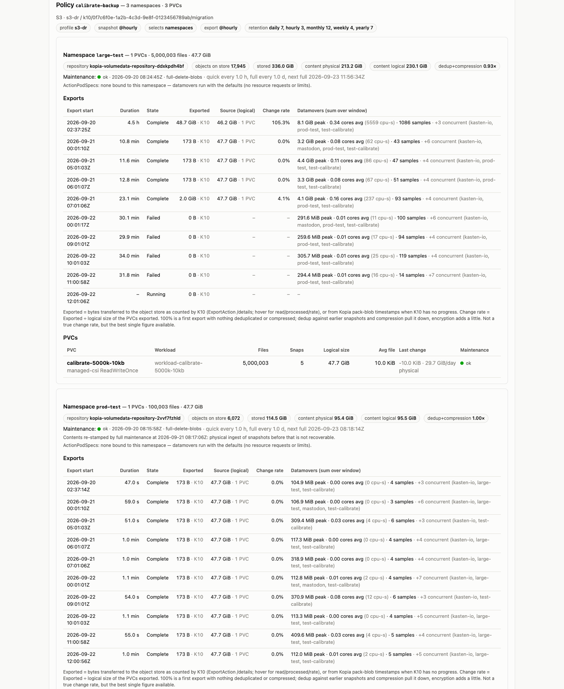
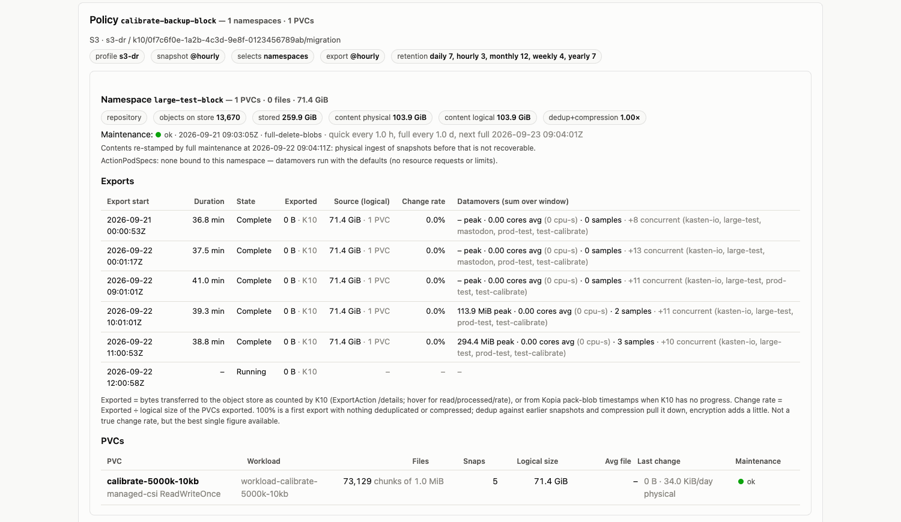

# K10 export audit — example findings

OpenShift 4.18 on Azure · Veeam Kasten K10 9.0.5 · 9 nodes · report generated 2026-09-20 07:35Z
with `generate-export-topology.py` → [the full report](export-topology-2026-09-20-09_44.html)
(cluster names anonymised). Everything below was read from the Kopia repositories on the
object store, K10's ExportAction counters, cluster monitoring and the kubelet — not from the
application volumes.

> **A change rate is measured, not guessed.** Nobody can tell from a PVC's size, storage
> class or application type what an export will cost. The only way to know is to run Kasten
> on the workload for a few cycles and read the repository: each export then reports what it
> read, what it hashed and what actually left for the object store. This report is that
> reading after 36 hours of exports on five namespaces, three of which are synthetic
> workloads with a *known* churn (20 % of the files rewritten every 10 hours) used to check
> that the measurement is right — it is.

## What was exported

3 export policies · 5 namespaces · 10 PVCs · 3 location profiles (2 × S3, 1 × Azure Files)

| Namespace | Policy | PVCs | Files | Logical size | Storage class | Workload |
|---|---|---:|---:|---:|---|---|
| mastodon | mastodon-backup `@daily` | 5 | 2,210 | 0.12 GB | managed-csi (Azure disk) | real application: PostgreSQL, Redis, Elasticsearch, MinIO |
| basic-app | basic-app-backup on demand | 2 | 4 | 0.02 GB | nfs-csi | demo app |
| prod-test | calibrate-backup `@hourly` | 1 | 100,003 | 51.2 GB | managed-csi | synthetic: 100 k × 500 KB, 20 % churn / 10 h |
| test-calibrate | calibrate-backup `@hourly` | 1 | 10,003 | 0.1 GB | managed-csi | synthetic: 10 k × 10 KB, 20 % churn / 10 h |
| large-test | calibrate-backup `@hourly` | 1 | 4,849,653 | 49.7 GB | managed-csi | synthetic: 5 M × 10 KB in two directories |

## Findings

### 1. Export time follows the number of files, not the number of bytes

Two volumes of the same size (≈ 50 GB) on the same storage class, exported by the same
policy to the same S3 profile:

| Volume | Files | First export | Throughput | Files / s | Datamover peak memory |
|---|---:|---:|---:|---:|---:|
| prod-test · 100 k × 500 KB | 100,003 | 9.8 min | 87 MB/s | ≈ 170 | 1.2 GB |
| large-test · 5 M × 10 KB | 4,849,653 | 4.5 h | 3 MB/s | ≈ 250 | 8.5 GB |

Both move a few hundred files per second whatever their size. Kopia hashes and uploads with
eight workers, but it enumerates and `stat`s a directory serially, and each entry is one
random read on a freshly cloned Azure Premium disk (P10 tier: 500 IOPS, 100 MB/s). With
large files the same disk hits its 100 MB/s ceiling instead — the two workloads sit on the
two limits of the same tier. The five-million-file volume also paid 8½ minutes before its
datamover container could start: the kubelet relabels every file for SELinux on a
`ReadWriteOnce` volume.

The per-file cost is paid even when nothing changed: an export of prod-test with zero
modified files still walks the 100,003 entries (55 s); for the five-million-file volume that
floor is around 40 minutes of pure metadata work per export.


*The large-test namespace in the report: 4.5-hour exports, 3 MB/s, one PVC of 4.85 M files in 2 directories.*

### 2. The measured change rate, and what it revealed about the workloads

Change rate here = bytes transferred to the object store ÷ logical size of the volume at
export time (K10's own counters; dedup and compression pull it below the fraction of files
that changed, per-file metadata pushes it slightly above 100 % on very small files).

| Namespace | Successive exports | Reading |
|---|---|---|
| prod-test | 100 % → 0 % → **20.1 %** → 0 % | matches the 20 % / 10 h churn built into the workload: the measurement is right |
| test-calibrate | 102 % → 0 % → **21.7 %** → 0 % | same, on 10 KB files (the extra 1–2 % is directory metadata) |
| mastodon | 74 % → 26 % → **0 %** (daily) | a real application at rest: the databases rewrite a few files a day (PostgreSQL 53 of 1,966 hashed), Redis dumps its whole 46 MB, Elasticsearch touches 14 of 167 files — all of it deduplicated or compressed to almost nothing |
| large-test | 101 % → 80 % → **105 %** → 105 % | **every export ~100 % new data although the workload was designed for 20 %** |

The last line is the point of measuring instead of assuming. The repository showed four
consecutive snapshots in which Kopia found *not one* unchanged file. The cause was in the
workload, not in the backup: its 74 GiB filesystem had exactly 4,849,664 inodes (ext4 creates
one per 16 KiB) for 5,000,003 files, the generator died at file 4,849,653 with "No space left
on device" while blocks were 77 % used, and on every restart it rewrote all files from the
start — a 100 % change rate, every 2 h 40, for 36 hours. From the Kopia standpoint the volume
was churning completely; from the application's it was "stuck". Both PVCs were resized to
81 GiB (5.3 M inodes) online during the audit and the generator was fixed to size for inodes
as well as bytes.


*prod-test: 100 k files of 500 KB; the 20 % churn appears exactly once every 10 hours.*

### 3. Deduplication and compression are a property of the data — this data set shows both extremes

- **Random bytes** (the calibration volumes): physical ÷ logical ratio 0.96–1.05 — nothing to
  compress, nothing to deduplicate. The large-test repository holds **242 GB on S3 for a
  49.7 GB volume**: four full rewrites, four full copies, until retention and Kopia's daily
  full maintenance reclaim them.
- **Real application data** (mastodon): PostgreSQL 0.14, Redis 0.10, Elasticsearch 0.20–0.25 —
  the namespace's 0.12 GB of logical data costs 0.02 GB of pack objects. This is the ratio to
  plan object-storage budgets with, and it cannot be known before the first export.

### 4. Datamovers run without any resource envelope, and their memory scales with the file count

Every datamover pod on this cluster is `BestEffort`: no requests, no limits
(`workerPodResourcesCRDEnabled=false`, no ActionPodSpec bound to any namespace). Measured
peaks: 0.1–0.3 GB for the small namespaces, 1.2 GB for 100 k files, **6.5–8.7 GB for the
4.85-million-file volume** — Kopia keeps the directory tree it is building in memory, roughly
1.5–2 GB per million files. CPU is not the constraint: 5,265 CPU-seconds over a 297-minute
export is 0.3 of a core on average. On a node with less free memory than that, the pod is
the first candidate for eviction, and the export restarts from its last checkpoint.

### 5. An hourly policy with a five-hour export

`calibrate-backup` runs `@hourly`; large-test needed 4.5 h per export, so K10 ran its exports
back to back (08:13, 17:01, 22:01, 02:37 — four in a day instead of twenty-four) while
prod-test and test-calibrate, in the same policy, kept the hourly rhythm. The three
namespaces export concurrently and share the cluster-wide datamover slots
(`K10LimiterSnapshotExportsPerCluster=10`, `…PerAction=3`); the report's *concurrent* column
shows which other datamovers were alive during each export.

### 6. Nodes at audit time

The cluster itself was idle during the exports: 8.7 of 115 allocatable cores in use, memory
at 39 %. Ephemeral storage is the exception: one worker and one master were at **82–83 %** of
the root filesystem the kubelet evicts on at 90 %. Datamovers write their Kopia cache and, in
filesystem mode, their upload buffers to that filesystem.


*Nodes at audit time, one sample when the report was generated.*

### 7. Two facts about Kopia worth knowing when reading any of this

- A long upload writes a **checkpoint** every 45 minutes; the 4.5-hour exports left five or
  six. They are not restore points — they let an interrupted export resume — and they explain
  "snapshots" sharing one start time in raw Kopia listings.
- Kopia's daily **full maintenance** rewrites pack objects and re-stamps their timestamps:
  per-snapshot attribution from the repository is exact only for the last 24 hours, which is
  why the export-level figures above come from K10's counters instead.

## Recommendations

### Storage

- **Export volumes with many small files in block mode.** Block mode reads the device
  sequentially and is indifferent to file count and directory layout; it also skips the
  SELinux relabel of the clone. The storage class already carries
  `k10.kasten.io/sc-supports-block-mode-exports: "true"`, so this is a policy-level choice.
  Expected effect on the five-million-file volume: from 4.5 h to well under an hour at the
  disk's sequential rate.
- **Match the disk tier of exported volumes to the export, not only to the application.** The
  clone K10 reads inherits the source tier; at P10 (500 IOPS / 100 MB/s) both calibration
  workloads were tier-bound. One tier up (P15/P20) or Premium SSD v2 roughly doubles to
  quadruples both limits.
- **Size filesystems for inodes as well as bytes** when files are smaller than 16 KiB (one
  inode per 16 KiB is ext4's default), and watch pod restart counts: a crash-looping writer
  shows up in the repository as a 100 % change rate long before anyone looks at the pod.

### Kasten configuration

- **Give datamovers a resource envelope.** Enable `workerPodResourcesCRDEnabled` and bind an
  ActionPodSpec to the namespaces with large file counts: a memory request of about 2 GB per
  million files protects the export from eviction, a limit protects the node's other tenants.
- **Align export frequency with export duration.** A namespace whose export takes hours does
  not belong in an hourly policy with small ones: it monopolises a datamover slot and its
  restore-point cadence becomes whatever the export time allows. Put it in its own policy
  with a realistic frequency, or fix the duration first (block mode).
- **Keep ephemeral headroom on the nodes that run datamovers.** Above 80 % root-filesystem
  usage a datamover's cache and buffers can trigger evictions; the 82–83 % nodes need
  attention before the next large export.
- **Re-measure after each change.** Change rate, dedup ratio and export duration are all
  readings, not estimates: run the same report again after switching a volume to block mode
  or moving a tier, and compare the same tables.

## Follow-up, two days later: the same policy starts failing

[Second report](export-topology-2026-09-22-14_12.html), 2026-09-22 12:10Z, same cluster.
`large-test` went from five successful exports to **four consecutive failures**, while
`prod-test` and `test-calibrate` — same policy, same profile, same hour — kept completing in
under a minute.



*Same policy, same S3 profile, same hourly firing. Above: `large-test` failing at 0 B
exported after ~30 minutes. Below: `prod-test` completing in ~1 minute.*

### How it was found

Five commands, in this order. Each one eliminated an explanation.

1. **Compare the namespace against its siblings.** `calibrate-backup` selects three
   namespaces; only one fails. That rules out the policy, the profile, the object store and
   the credentials in a single step.

   ```bash
   for ns in large-test prod-test test-calibrate large-test-block; do
     printf '%-18s ' "$ns"
     kubectl -n $ns get exportactions.actions.kio.kasten.io -o json \
       | jq -rc '[.items[].status.state] | group_by(.) | map("\(length) \(.[0])") | join(", ")'
   done
   ```

   `large-test` 5 Complete / 4 Failed · the other three: Complete only. Note
   `large-test-block` in that list — **the same data exported in block mode, 0 failures**.

2. **Read the innermost cause, not the top-level message.** `status.error.message` says only
   "Job failed to be executed"; the real cause is at the bottom of a nested `cause` chain
   (guide 13):

   ```
   failed to open repository: unable to establish session ...
   dial tcp 172.30.230.104:51515: connect: connection refused
   ```

   The `copy-vol-data` pod cannot reach the Kopia repository server. A different service IP
   each time, so not a network policy — the server is simply not there.

3. **Ask the kubelet why the server is not there.** The answer is in the events, not the logs:

   ```bash
   kubectl -n kasten-io get events --sort-by=.lastTimestamp -o json \
     | jq -r '.items[] | select(.type=="Warning")
              | select(.involvedObject.name|test("data-mover|copy-vol-data"))
              | [(.lastTimestamp//"-"), .involvedObject.name, .reason, (.message[0:110])] | @tsv'
   ```

   ```
   data-mover-svc-jw7pp  Evicted  Usage of EmptyDir volume "kopia-cache-volume" exceeds the limit "3000Mi"
   copy-vol-data-jmdhx   Failed   Error: context deadline exceeded
   ```

   **13 evictions per hour**, every hour. `data-mover-svc` *is* the Kopia repository server;
   the kubelet evicts it for overrunning its cache volume, and the export dies with it.

4. **Measure what the cache has to hold.** Connect read-only to the repository (guide 12
   step 4) and size the index:

   ```bash
   kopia_exec 'kopia blob list --json' > blobs.json
   jq -r '[.[] | {p:(.id[0:1]), l:.length}] | group_by(.p)
          | map({prefix:.[0].p, count:length, MiB:((map(.l)|add)/1048576*10|round/10)}) | .[]' blobs.json
   ```

   | Blob class | Blobs | Size |
   |---|---:|---:|
   | `x` index | 371 | 1,531 MiB |
   | `q` metadata packs | 211 | 3,238 MiB |
   | **index + metadata** | **582** | **4,769 MiB ≈ 4.66 GiB** |
   | `p` data packs | 16,929 | 337.7 GiB |

   Against `k10DataStoreTotalCacheSizeLimitMB = 3000`. **The repository's index no longer
   fits in the datamover's cache volume.** Five million files of 10 KiB generate 4.66 GiB of
   directory metadata and index; the server must read it to do incremental deduplication,
   into a 3 GiB `emptyDir` with a hard `sizeLimit`. This is arithmetic, not tuning.

5. **Explain why it worked on Sunday and not on Tuesday.** The snapshot history says it:

   | Date | Files | Hashed | Result |
   |---|---:|---:|---|
   | 09-20 02:48 | 4,849,653 | all | Complete, 4.5 h, 48.7 GiB |
   | 09-21 ×3 | 5,000,003 | 0 | Complete, 11–13 min, 173 B |
   | 09-21 07:01 | 5,000,003 | 116,373 | Complete, 23 min, 2.0 GiB |
   | 09-22 ×4 | — | — | **Failed, 0 B** |

   The first export *built* the index as it went, so there was nothing to load. Now five
   snapshots of five million files exist and the accumulated index exceeds the cache on every
   session. **It does not self-correct: each new snapshot makes it worse.**

The file count moved from 4,849,653 to 5,000,003 because the PVC was expanded 74 → 81 GiB,
lifting the ext4 inode ceiling that had capped the workload (finding 2 above).

### A second cost: the repository is four times the data

`large-test` stores **336.0 GiB on S3 for a 47.7 GiB volume**, of which `content physical` is
213.2 GiB. The ~123 GiB gap is pack objects written by attempts that died before their
content was indexed — every failed export uploads for twenty-odd minutes and then loses the
server. Kopia's full maintenance reclaims unreferenced packs, but it runs daily and the
failures are hourly. Failing exports are not free.

### Recommendation: move the Kopia cache off the node

The cache volume is an `emptyDir` with a hard `sizeLimit`, so it fails twice over: it caps
the cache at a size the workload has outgrown, and what it does hold counts against the
node's ephemeral storage — the same filesystem that finding 6 shows at 82–83 % on two nodes.
A generic ephemeral volume — a PVC created and destroyed with the pod — fixes both.

K10 applies a pod spec patch to **all Kanister job pods** from a ConfigMap named
`pod-spec-override` in the K10 namespace
([documentation](https://docs.kasten.io/latest/kanister/override/)). Nothing refers to it:
creating the ConfigMap is enough, and K10 picks it up on the next job pod with no Helm
upgrade, no CR edit and no restart.

There are three steps, and the first two are where this goes wrong.

#### Step 1 — override the volume by name, do not add a mount

```yaml
apiVersion: v1
kind: ConfigMap
metadata:
  name: pod-spec-override
  namespace: kasten-io
data:
  override: |
    kind: Pod
    spec:
      volumes:
        - name: kopia-cache-volume        # the EXISTING volume, replaced by name
          ephemeral:
            volumeClaimTemplate:
              metadata:
                labels:
                  kopia: cache-volume
              spec:
                accessModes: [ "ReadWriteOnce" ]
                storageClassName: "managed-csi"
                resources:
                  requests:
                    storage: 50Gi
```

The datamover mounts two `emptyDir`s — `tmp-volume` at `/tmp` with no limit, and
`kopia-cache-volume` at `/tmp/kopia-cache` with `sizeLimit: 3000Mi`. Only the nested one is
evicted, so the override has to reach *that* volume.

The instinct is to add a volume of your own plus a `volumeMounts` entry pointing at
`/tmp/kopia-cache`. **That does not work**: K10 *appends* to `volumeMounts` rather than
merging on `mountPath`, and the pod is rejected outright —

```
Pod "data-mover-svc-2tr6j" is invalid:
  spec.containers[0].volumeMounts[3].mountPath: Invalid value: "/tmp/kopia-cache": must be unique
```

Mounting at `/tmp` instead collides with `tmp-volume` the same way. `volumes`, however, *is*
merged by `name` — so declaring `kopia-cache-volume` with an `ephemeral` source replaces the
`emptyDir` in place, K10's own mount at `/tmp/kopia-cache` is left untouched, and no
`volumeMounts` stanza is needed at all.

#### Step 2 — on OpenShift, let the SCC admit ephemeral volumes

K10 ships its own `k10-scc`, and its allowed volume list does not include `ephemeral`:

```console
$ kubectl get scc k10-scc -o jsonpath='{.volumes}'
["configMap","downwardAPI","emptyDir","persistentVolumeClaim","projected","secret"]
```

Until it does, **every** worker pod is rejected at admission — the metadata export too, so
all backups fail, not just the large one:

```
pods "data-mover-svc-" is forbidden: unable to validate against any security context
constraint: spec.volumes[0]: Invalid value: "ephemeral": ephemeral volumes are not allowed
to be used
```

```console
$ kubectl get scc k10-scc -o json > k10-scc-backup.json      # keep a way back
$ kubectl patch scc k10-scc --type=json \
    -p '[{"op":"add","path":"/volumes/-","value":"ephemeral"}]'
securitycontextconstraints.security.openshift.io/k10-scc patched
```

This is a change to a security control, so treat it as one: it widens the volume types K10's
service accounts may use, cluster-wide for those accounts. It is scoped to K10's own SCC
rather than `restricted-v2`, which is the reason to patch `k10-scc` and not the shared one.
Get it agreed before applying, and expect a hand edit to be reverted on the next operator
reconcile or chart upgrade — the durable form is a chart value, not `kubectl patch`.

**If the SCC change is not acceptable**, do not reach for a pre-created
`persistentVolumeClaim` instead. It is in the allowed list, but one PVC shared by every
Kanister job pod means concurrent Kopia caches writing into the same volume with no
isolation and nothing to clean them up — and on `ReadWriteOnce` the second pod simply will
not schedule. The per-pod lifecycle is the point of the ephemeral volume, not an incidental
detail.

The two real alternatives are:

- **Export the volume in block mode.** No per-file metadata, so no index to cache, so the
  problem does not exist. This is the better answer even where the SCC *can* be changed.
- **Raise the cache ceiling and keep it on the node.** The `emptyDir` `sizeLimit` is
  `3000Mi` and `k10DataStoreTotalCacheSizeLimitMB` is `3000`; the two track each other, so
  raising the setting is the obvious route that needs no SCC change and no override at all.
  Confirm on your own cluster that a new worker pod's `sizeLimit` follows the value before
  relying on it. The cost is that the cache stays on the node's root filesystem: 8 GiB per
  pod × `K10LimiterSnapshotExportsPerCluster` (10) is 80 GiB of ephemeral storage during a
  busy window, on nodes this report already shows at 82–83 %. That trades an eviction for
  `sizeLimit` against an eviction for node disk pressure — which is precisely why moving the
  cache onto a PVC is the more durable fix.

#### Step 3 — verify on something small first

```console
$ kubectl -n kasten-io get pvc -l kopia=cache-volume
NAME                                                                  STATUS    STORAGECLASS
repo-access-kopia-volumedata-repository-98v2rkz7sx-kopia-cache-volume Pending   managed-csi
repo-access-kopia-metadata-repository-sv6qxrvbvd-kopia-cache-volume   Pending   managed-csi
```

One PVC per worker pod, named `<pod>-kopia-cache-volume`, created and deleted with it. A
run of the smallest policy confirms admission and binding in under a minute — much cheaper
than discovering a rejected pod half an hour into the export you were trying to fix.

#### Sizing and blast radius

- **Size against the index, not the volume.** 4.66 GiB today and growing with every
  snapshot; 50 GiB leaves room. `k10DataStoreTotalCacheSizeLimitMB` (3000) stays as Kopia's
  own soft budget — raise it too, or Kopia keeps sweeping a cache that now has room.
- **It applies to every Kanister job pod on the cluster.** 50 GiB per datamover ×
  `K10LimiterSnapshotExportsPerCluster` (10) is 500 GiB of provisioned disk during a busy
  window, and it adds a PVC create/attach/delete cycle to every small export too. Scope it
  with an `ActionPodSpec` binding if only one namespace needs it.

#### What was verified on this cluster

| Step | Result |
|---|---|
| ConfigMap picked up with no Helm/CR change, no restart | **yes** — the next worker pod carried the patched spec |
| Override by `volumeMounts` at `/tmp/kopia-cache` | **rejected** — `mountPath ... must be unique`; K10 appends rather than merging on path |
| Override the `kopia-cache-volume` volume by name | **works** — `emptyDir` replaced by the PVC, K10's own mount untouched |
| `k10-scc` patched to allow `ephemeral` | **required** — without it every worker pod is rejected and all backups fail |
| Small policy end to end | **Complete**, one `<pod>-kopia-cache-volume` PVC per worker pod, created and deleted with it |
| Five-million-file export | **40 minutes, 0 evictions, 2.2 GB transferred and rising** — every previous attempt was evicted within 21–34 minutes having transferred nothing |

The eviction is fixed. The export ran past forty minutes — comfortably beyond the 21–34
minute band in which all four previous attempts died — with no eviction of any worker pod
and a transfer rate climbing from 0.7 to 4.5 MB/s as Kopia got through the enumeration. It
was still running when this was written, so the **end-to-end duration is not yet measured**;
the first full export of this volume took 4.5 hours and there is no reason to expect much
better, which is the argument for block mode below rather than for this fix.

One number to take from the PVC list while that ran: **six** cache PVCs bound at 50 GiB, or
300 GiB provisioned, including one for the *block-mode* policy's upload pod — which does not
need it. That is the blast radius in the last bullet above, visible in practice.

### The cheaper fix: export the same volume in block mode

This cluster runs the controlled experiment already. `large-test-block` holds **the same
five million 10 KiB files**, on the same storage class, at the same 81 GiB, exported by an
identical hourly policy to the same S3 profile. The two PVCs differ in exactly one thing:

```console
$ kubectl -n large-test-block get pvc calibrate-5000k-10kb \
    -o jsonpath='{.metadata.annotations}' | jq
{
  "k10.kasten.io/pvc-export-volume-in-block-mode": "force",
  ...
}
```

Note `volumeMode: Filesystem` on **both** PVCs. This is not a block-mode volume — it is an
ordinary filesystem PVC that K10 has been told to export as a block device. K10 clones the
CSI snapshot and exports the clone's raw device, so the file count and the directory layout
stop mattering: there is no per-file metadata, no index to cache, and no SELinux relabel of
five million inodes before the container starts.



*The same five million files, exported in block mode: 73,129 chunks of 1 MiB instead of
files, and every export Complete.*

| | filesystem mode (`large-test`) | block mode (`large-test-block`) |
|---|---|---|
| PVC | `volumeMode: Filesystem` | `volumeMode: Filesystem` **+ the annotation** |
| Kopia tree | 5,000,003 files | 73,129 chunks of 1 MiB |
| Index + metadata to cache | **4.66 GiB** | none — no per-file metadata |
| First export | 4.5 h | 36.8 min |
| Steady state | 11 min … then **4 failures** | 36.8 / 37.5 / 41.0 / 39.3 / 38.8 min, **all Complete** |
| Objects on store | 17,945 · 336.0 GiB | 13,670 · 259.9 GiB |
| Datamover peak memory | **8.1 GiB** (namespace) | **0.43–0.78 GiB** (whole cluster) |

The memory row is the one to read twice. The 8.1 GiB is what the filesystem-mode export of
this volume cost on its own; the block-mode figures are the peak across **every** datamover
on the cluster during each of three block exports — an upper bound, and still an order of
magnitude lower. Kopia holds the directory tree it is building in memory, and block mode has
no tree to hold.

Block mode reads the whole device every time (76.7 GB at ~37 MB/s), so it does not get the
"nothing changed, finish in 11 minutes" case that filesystem mode enjoys when it works.
That is the trade: a predictable 40 minutes every hour instead of 11 minutes when lucky and
a failure when not. For a five-million-file volume that is the better bargain, and it needs
no SCC change, no pod override and no extra storage — one annotation on the PVC.

---

Generated from `generate-export-topology.py` / `render-export-topology.py`
([k10-perf-collect](https://github.com/michaelcourcy/k10-perf-collect)). Synthetic
workloads from [kasten-calibrate](https://github.com/michaelcourcy/kasten-calibrate).
