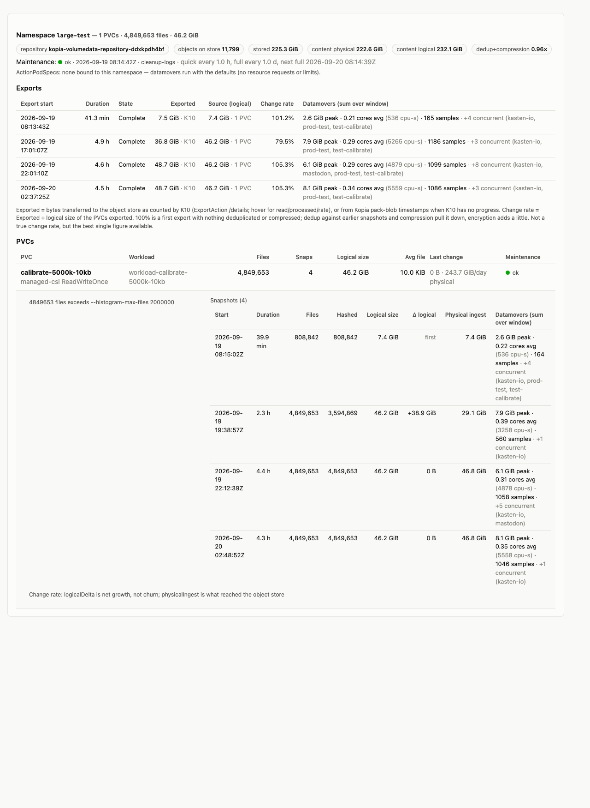
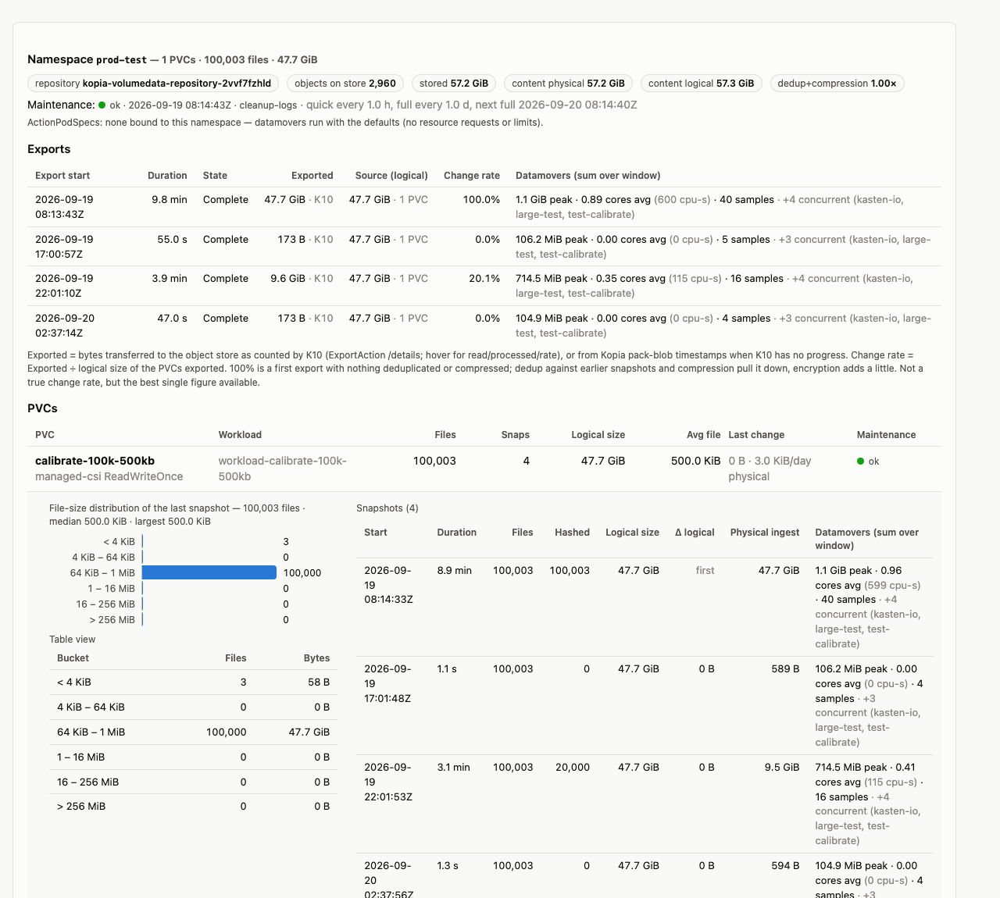
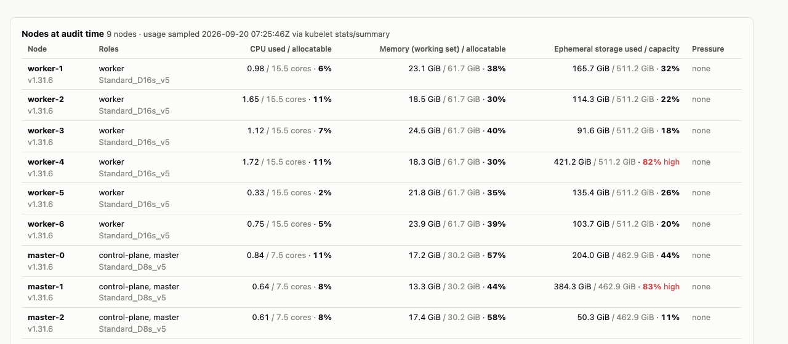

# K10 export audit — example findings

OpenShift 4.18 on Azure · Veeam Kasten K10 9.0.5 · 9 nodes · report generated 2026-09-20 07:35Z
with `generate-export-topology.py` → [the full report](export-topology-2026-09-20-09_44.html)
(cluster names anonymised). Everything below was read from the Kopia repositories on the
object store, K10's ExportAction counters, cluster monitoring and the kubelet — not from the
application volumes.

> **A change rate is measured, not guessed.** Nobody can tell from a PVC's size, storage
> class or application type what an export will cost. The only way to know is to run Kasten
> on the workload for a few cycles and read the repository: each export then reports what it
> read, what it hashed and what actually left for the object store. This report is that
> reading after 36 hours of exports on five namespaces, three of which are synthetic
> workloads with a *known* churn (20 % of the files rewritten every 10 hours) used to check
> that the measurement is right — it is.

## What was exported

3 export policies · 5 namespaces · 10 PVCs · 3 location profiles (2 × S3, 1 × Azure Files)

| Namespace | Policy | PVCs | Files | Logical size | Storage class | Workload |
|---|---|---:|---:|---:|---|---|
| mastodon | mastodon-backup `@daily` | 5 | 2,210 | 0.12 GB | managed-csi (Azure disk) | real application: PostgreSQL, Redis, Elasticsearch, MinIO |
| basic-app | basic-app-backup on demand | 2 | 4 | 0.02 GB | nfs-csi | demo app |
| prod-test | calibrate-backup `@hourly` | 1 | 100,003 | 51.2 GB | managed-csi | synthetic: 100 k × 500 KB, 20 % churn / 10 h |
| test-calibrate | calibrate-backup `@hourly` | 1 | 10,003 | 0.1 GB | managed-csi | synthetic: 10 k × 10 KB, 20 % churn / 10 h |
| large-test | calibrate-backup `@hourly` | 1 | 4,849,653 | 49.7 GB | managed-csi | synthetic: 5 M × 10 KB in two directories |

## Findings

### 1. Export time follows the number of files, not the number of bytes

Two volumes of the same size (≈ 50 GB) on the same storage class, exported by the same
policy to the same S3 profile:

| Volume | Files | First export | Throughput | Files / s | Datamover peak memory |
|---|---:|---:|---:|---:|---:|
| prod-test · 100 k × 500 KB | 100,003 | 9.8 min | 87 MB/s | ≈ 170 | 1.2 GB |
| large-test · 5 M × 10 KB | 4,849,653 | 4.5 h | 3 MB/s | ≈ 250 | 8.5 GB |

Both move a few hundred files per second whatever their size. Kopia hashes and uploads with
eight workers, but it enumerates and `stat`s a directory serially, and each entry is one
random read on a freshly cloned Azure Premium disk (P10 tier: 500 IOPS, 100 MB/s). With
large files the same disk hits its 100 MB/s ceiling instead — the two workloads sit on the
two limits of the same tier. The five-million-file volume also paid 8½ minutes before its
datamover container could start: the kubelet relabels every file for SELinux on a
`ReadWriteOnce` volume.

The per-file cost is paid even when nothing changed: an export of prod-test with zero
modified files still walks the 100,003 entries (55 s); for the five-million-file volume that
floor is around 40 minutes of pure metadata work per export.

*The large-test namespace in the report: 4.5-hour exports, 3 MB/s, one PVC of 4.85 M files in 2 directories.*

### 2. The measured change rate, and what it revealed about the workloads

Change rate here = bytes transferred to the object store ÷ logical size of the volume at
export time (K10's own counters; dedup and compression pull it below the fraction of files
that changed, per-file metadata pushes it slightly above 100 % on very small files).

| Namespace | Successive exports | Reading |
|---|---|---|
| prod-test | 100 % → 0 % → **20.1 %** → 0 % | matches the 20 % / 10 h churn built into the workload: the measurement is right |
| test-calibrate | 102 % → 0 % → **21.7 %** → 0 % | same, on 10 KB files (the extra 1–2 % is directory metadata) |
| mastodon | 74 % → 26 % → **0 %** (daily) | a real application at rest: the databases rewrite a few files a day (PostgreSQL 53 of 1,966 hashed), Redis dumps its whole 46 MB, Elasticsearch touches 14 of 167 files — all of it deduplicated or compressed to almost nothing |
| large-test | 101 % → 80 % → **105 %** → 105 % | **every export ~100 % new data although the workload was designed for 20 %** |

The last line is the point of measuring instead of assuming. The repository showed four
consecutive snapshots in which Kopia found *not one* unchanged file. The cause was in the
workload, not in the backup: its 74 GiB filesystem had exactly 4,849,664 inodes (ext4 creates
one per 16 KiB) for 5,000,003 files, the generator died at file 4,849,653 with "No space left
on device" while blocks were 77 % used, and on every restart it rewrote all files from the
start — a 100 % change rate, every 2 h 40, for 36 hours. From the Kopia standpoint the volume
was churning completely; from the application's it was "stuck". Both PVCs were resized to
81 GiB (5.3 M inodes) online during the audit and the generator was fixed to size for inodes
as well as bytes.

*prod-test: 100 k files of 500 KB; the 20 % churn appears exactly once every 10 hours.*

### 3. Deduplication and compression are a property of the data — this data set shows both extremes

- **Random bytes** (the calibration volumes): physical ÷ logical ratio 0.96–1.05 — nothing to
  compress, nothing to deduplicate. The large-test repository holds **242 GB on S3 for a
  49.7 GB volume**: four full rewrites, four full copies, until retention and Kopia's daily
  full maintenance reclaim them.
- **Real application data** (mastodon): PostgreSQL 0.14, Redis 0.10, Elasticsearch 0.20–0.25 —
  the namespace's 0.12 GB of logical data costs 0.02 GB of pack objects. This is the ratio to
  plan object-storage budgets with, and it cannot be known before the first export.

### 4. Datamovers run without any resource envelope, and their memory scales with the file count

Every datamover pod on this cluster is `BestEffort`: no requests, no limits
(`workerPodResourcesCRDEnabled=false`, no ActionPodSpec bound to any namespace). Measured
peaks: 0.1–0.3 GB for the small namespaces, 1.2 GB for 100 k files, **6.5–8.7 GB for the
4.85-million-file volume** — Kopia keeps the directory tree it is building in memory, roughly
1.5–2 GB per million files. CPU is not the constraint: 5,265 CPU-seconds over a 297-minute
export is 0.3 of a core on average. On a node with less free memory than that, the pod is
the first candidate for eviction, and the export restarts from its last checkpoint.

### 5. An hourly policy with a five-hour export

`calibrate-backup` runs `@hourly`; large-test needed 4.5 h per export, so K10 ran its exports
back to back (08:13, 17:01, 22:01, 02:37 — four in a day instead of twenty-four) while
prod-test and test-calibrate, in the same policy, kept the hourly rhythm. The three
namespaces export concurrently and share the cluster-wide datamover slots
(`K10LimiterSnapshotExportsPerCluster=10`, `…PerAction=3`); the report's *concurrent* column
shows which other datamovers were alive during each export.

### 6. Nodes at audit time

The cluster itself was idle during the exports: 8.7 of 115 allocatable cores in use, memory
at 39 %. Ephemeral storage is the exception: one worker and one master were at **82–83 %** of
the root filesystem the kubelet evicts on at 90 %. Datamovers write their Kopia cache and, in
filesystem mode, their upload buffers to that filesystem.

*Nodes at audit time, one sample when the report was generated.*

### 7. Two facts about Kopia worth knowing when reading any of this

- A long upload writes a **checkpoint** every 45 minutes; the 4.5-hour exports left five or
  six. They are not restore points — they let an interrupted export resume — and they explain
  "snapshots" sharing one start time in raw Kopia listings.
- Kopia's daily **full maintenance** rewrites pack objects and re-stamps their timestamps:
  per-snapshot attribution from the repository is exact only for the last 24 hours, which is
  why the export-level figures above come from K10's counters instead.

## Recommendations

### Storage

- **Export volumes with many small files in block mode.** Block mode reads the device
  sequentially and is indifferent to file count and directory layout; it also skips the
  SELinux relabel of the clone. The storage class already carries
  `k10.kasten.io/sc-supports-block-mode-exports: "true"`, so this is a policy-level choice.
  Expected effect on the five-million-file volume: from 4.5 h to well under an hour at the
  disk's sequential rate.
- **Match the disk tier of exported volumes to the export, not only to the application.** The
  clone K10 reads inherits the source tier; at P10 (500 IOPS / 100 MB/s) both calibration
  workloads were tier-bound. One tier up (P15/P20) or Premium SSD v2 roughly doubles to
  quadruples both limits.
- **Size filesystems for inodes as well as bytes** when files are smaller than 16 KiB (one
  inode per 16 KiB is ext4's default), and watch pod restart counts: a crash-looping writer
  shows up in the repository as a 100 % change rate long before anyone looks at the pod.

### Kasten configuration

- **Give datamovers a resource envelope.** Enable `workerPodResourcesCRDEnabled` and bind an
  ActionPodSpec to the namespaces with large file counts: a memory request of about 2 GB per
  million files protects the export from eviction, a limit protects the node's other tenants.
- **Align export frequency with export duration.** A namespace whose export takes hours does
  not belong in an hourly policy with small ones: it monopolises a datamover slot and its
  restore-point cadence becomes whatever the export time allows. Put it in its own policy
  with a realistic frequency, or fix the duration first (block mode).
- **Keep ephemeral headroom on the nodes that run datamovers.** Above 80 % root-filesystem
  usage a datamover's cache and buffers can trigger evictions; the 82–83 % nodes need
  attention before the next large export.
- **Re-measure after each change.** Change rate, dedup ratio and export duration are all
  readings, not estimates: run the same report again after switching a volume to block mode
  or moving a tier, and compare the same tables.

---

Generated from `generate-export-topology.py` / `render-export-topology.py`
([k10-perf-collect](https://github.com/michaelcourcy/k10-perf-collect)). Synthetic
workloads from [kasten-calibrate](https://github.com/michaelcourcy/kasten-calibrate).
